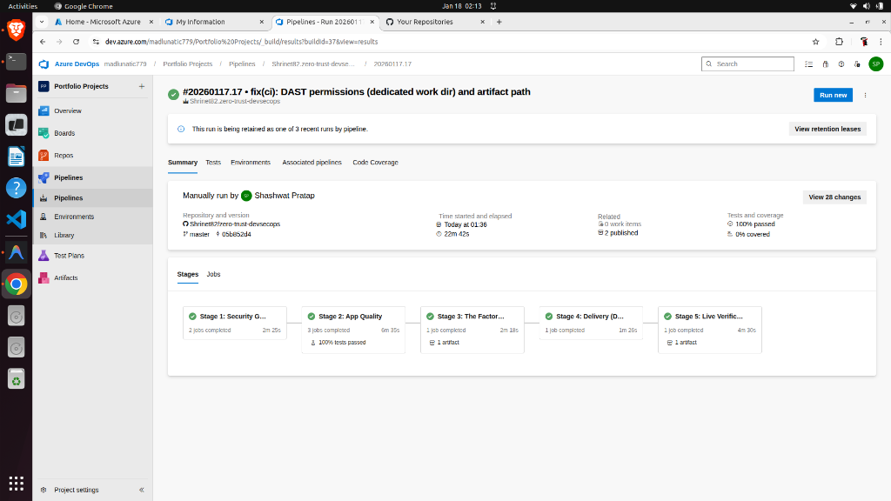
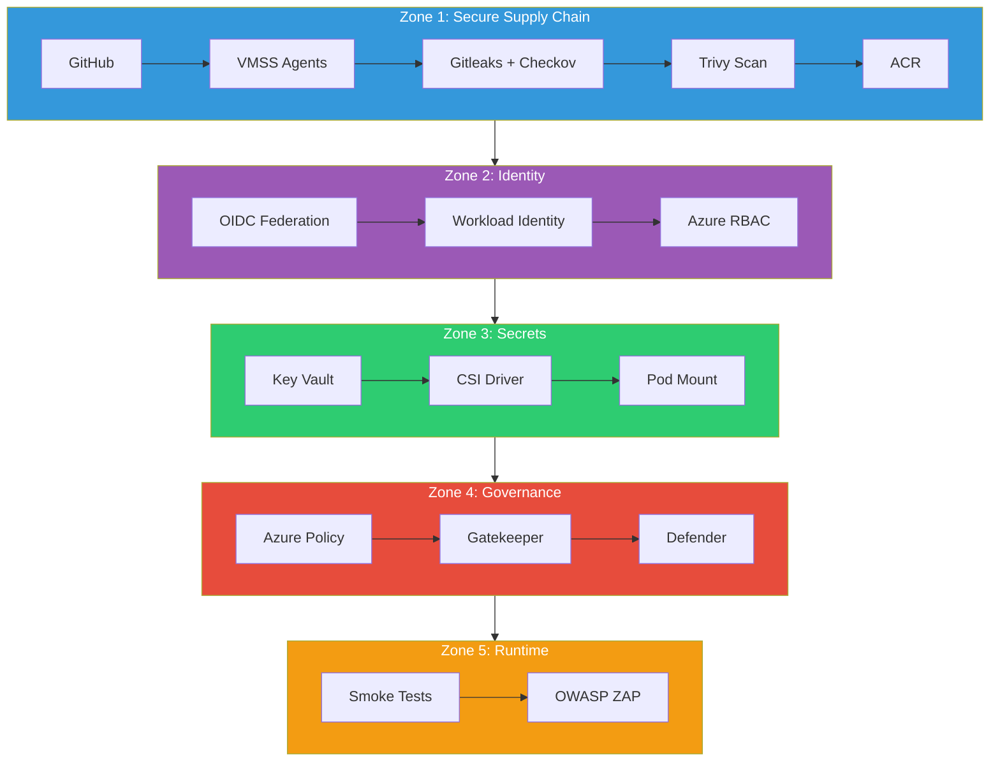

# 🛡️ Zero-Trust Azure DevSecOps Platform

[](https://azure.microsoft.com)
[](https://terraform.io)
[](https://azure.microsoft.com/en-us/products/kubernetes-service)
[](https://learn.microsoft.com/en-us/security/zero-trust/)
[](https://dev.azure.com)

> **A production-grade, 2026-compliant DevSecOps pipeline demonstrating Zero-Trust security principles with a 5-stage "Shift Left" architecture on Microsoft Azure.**

---

## 🚀 Pipeline Success

> **All 5 stages passing with 100% test coverage and published security artifacts.**



| Stage | Name              | Duration | Status    |
| ----- | ----------------- | -------- | --------- |
| 1     | Security Gates    | 2m 25s   | ✅ Passed |
| 2     | App Quality       | 5m 35s   | ✅ Passed |
| 3     | Build Factory     | 2m 18s   | ✅ Passed |
| 4     | Delivery          | 1m 25s   | ✅ Passed |
| 5     | Live Verification | 4m 30s   | ✅ Passed |

---

## 📊 Pipeline Architecture

### 5-Stage "Shift Left" Flow

```mermaid
flowchart LR
    subgraph S1["Stage 1: Security Gates"]
        S1A[Gitleaks]
        S1B[Checkov]
    end

    subgraph S2["Stage 2: App Quality"]
        S2A[Flake8]
        S2B[Trivy FS]
        S2C[Pytest]
    end

    subgraph S3["Stage 3: Build Factory"]
        S3A[Docker Build]
        S3B[SBOM Gen]
        S3C[Trivy Image]
        S3D[ACR Push]
    end

    subgraph S4["Stage 4: Delivery"]
        S4A[AKS Deploy]
    end

    subgraph S5["Stage 5: Verification"]
        S5A[Smoke Test]
        S5B[OWASP ZAP]
    end

    S1 --> S2 --> S3 --> S4 --> S5

    style S1 fill:#e74c3c,color:#fff
    style S2 fill:#f39c12,color:#fff
    style S3 fill:#3498db,color:#fff
    style S4 fill:#2ecc71,color:#fff
    style S5 fill:#9b59b6,color:#fff
```



---

## 🛡️ Security Zones



---

## ☸️ Kubernetes Architecture

```mermaid
graph TB
    subgraph AKS["AKS Cluster"]
        subgraph NS["default namespace"]
            SVC[Service: sample-app]
            DEP[Deployment]
            POD[Pod]
            VOL[/mnt/secrets-store]

            SVC --> POD
            DEP --> POD
            POD --> VOL
        end

        subgraph GK["gatekeeper-system"]
            WEBHOOK[Admission Webhook]
        end
    end

    subgraph Azure["Azure Services"]
        KV[Key Vault]
        ACR[Container Registry]
    end

    KV -->|CSI Driver| VOL
    ACR -->|Pull Image| POD
    WEBHOOK -->|Validate| POD

    style AKS fill:#326ce5,color:#fff
    style KV fill:#2ecc71,color:#fff
    style ACR fill:#3498db,color:#fff
    style WEBHOOK fill:#e74c3c,color:#fff
```

---

## 🛠️ Technology Stack

| Category        | Technology                  | Purpose                        |
| --------------- | --------------------------- | ------------------------------ |
| **Cloud**       | Azure (AKS, ACR, Key Vault) | Infrastructure                 |
| **IaC**         | Terraform                   | Provisioning                   |
| **CI/CD**       | Azure DevOps + VMSS Agents  | Pipeline                       |
| **Secret Scan** | Gitleaks                    | Pre-commit secrets detection   |
| **IaC Scan**    | Checkov                     | Kubernetes manifest validation |
| **SAST**        | Trivy (FS + Image)          | Vulnerability scanning         |
| **SBOM**        | CycloneDX (Trivy)           | Software bill of materials     |
| **DAST**        | OWASP ZAP                   | Runtime vulnerability scan     |
| **Secrets**     | Secrets Store CSI Driver    | Secure injection               |
| **Policy**      | Azure Policy + Gatekeeper   | Pod security enforcement       |
| **Defense**     | Microsoft Defender          | Runtime protection             |

---

## ✅ Zero-Trust Controls

| Control              | Type       | Enforcement        | Evidence                    |
| -------------------- | ---------- | ------------------ | --------------------------- |
| No Hardcoded Secrets | Preventive | Gitleaks Gate      | Pipeline fails on detection |
| IaC Best Practices   | Preventive | Checkov Gate       | Misconfiguration blocked    |
| No Critical CVEs     | Preventive | Trivy Kill Logic   | Build fails on CRITICAL     |
| OIDC Authentication  | Preventive | Service Connection | No stored credentials       |
| Secrets via CSI      | Preventive | Pod Spec           | No env var exposure         |
| No Privileged Pods   | Preventive | Gatekeeper Webhook | Admission denied            |
| No Root Containers   | Preventive | Gatekeeper Webhook | Admission denied            |
| Seccomp Required     | Preventive | Gatekeeper Webhook | RuntimeDefault enforced     |
| Runtime Threats      | Detective  | Defender           | Log Analytics alerts        |
| DAST Validation      | Detective  | OWASP ZAP          | HTML report published       |

---

## 🚀 Quick Start

### Prerequisites

```bash
# Azure CLI, Terraform, kubectl, kubelogin
az login
az account set --subscription "Your Subscription"
```

### Deploy Infrastructure

```bash
cd devsecops-infra
terraform init && terraform apply -auto-approve
```

### Verify Deployment

```bash
# Get AKS credentials
az aks get-credentials -g rg-devsecops-prod -n aks-devsecops-prod
kubelogin convert-kubeconfig -l azurecli

# Check pod
kubectl get pods -l app=sample-app

# Verify secret injection
kubectl exec deployment/sample-app -- cat /mnt/secrets-store/AppApiKey
# Output: SUPER_SECRET_REMOTEROLE_KEY_2026
```

### Test Policy Enforcement

```bash
# Attempt privileged pod (should be DENIED)
kubectl run hack --image=nginx --privileged

# Expected: admission webhook "validation.gatekeeper.sh" denied the request
```

---

## 📁 Repository Structure

```
.
├── azure-pipelines.yml      # 5-stage pipeline definition
├── app/
│   ├── app.py               # Flask application
│   ├── Dockerfile           # Hardened container
│   ├── requirements.txt
│   └── test_app.py          # Unit tests
├── k8s/
│   ├── deployment.yaml      # Pod with securityContext
│   ├── service.yaml         # ClusterIP service
│   └── secretproviderclass.yaml  # Key Vault CSI config
├── devsecops-infra/
│   ├── main.tf              # AKS, ACR, Key Vault
│   └── vmss.tf              # Self-hosted agents
└── docs/
    └── screenshots/
```

---

## 📊 Artifacts Published

| Artifact           | Stage             | Purpose                              |
| ------------------ | ----------------- | ------------------------------------ |
| `sbom.json`        | Build Factory     | CycloneDX software bill of materials |
| `zap_report.html`  | Live Verification | OWASP ZAP DAST findings              |
| `test-results.xml` | App Quality       | Pytest JUnit report                  |

---

## 🏆 Key Achievements

- ✅ **100% Pipeline Success Rate** - All 5 stages green
- ✅ **Zero Critical Vulnerabilities** - Trivy kill logic enforced
- ✅ **No Hardcoded Secrets** - Gitleaks validated
- ✅ **Policy Compliant** - Restricted Pod Security Standard
- ✅ **Runtime Protected** - Defender + ZAP validated
- ✅ **Secretless Authentication** - OIDC + Workload Identity

---

## 📜 License

MIT License - See [LICENSE](LICENSE) for details.

---

<p align="center">
  <b>Built with ❤️ by Shashwat Pratap</b><br>
  <a href="https://github.com/Shrinet82">GitHub</a> • 
  <a href="https://linkedin.com/in/shrinet82">LinkedIn</a>
</p>
