# 🛡️ Zero-Trust Azure DevSecOps Platform

[](https://azure.microsoft.com)
[](https://azure.microsoft.com/en-us/products/kubernetes-service)
[](https://dev.azure.com)

> **A 5-stage DevSecOps pipeline with automated security scanning, SBOM generation, and DAST testing on Azure.**

---

## 📊 Actual Project Metrics

### Pipeline Performance (Measured)

| Metric                  | Value             | Notes                          |
| ----------------------- | ----------------- | ------------------------------ |
| Total Pipeline Duration | **32 min 52 sec** | From commit to live deployment |
| Stage 1: Security Gates | 4m 26s            | Gitleaks + Checkov             |
| Stage 2: App Quality    | 3m 9s             | Backend + Frontend validation  |
| Stage 3: Build Factory  | 10m 23s           | Docker build + Trivy + SBOM    |
| Stage 4: Delivery       | 2m 12s            | AKS deployment                 |
| Stage 5: Verification   | 6m 39s            | Smoke test + OWASP ZAP         |

### Security Findings (Actual)

| Check              | Result                    | Action Taken                                          |
| ------------------ | ------------------------- | ----------------------------------------------------- |
| Gitleaks (Secrets) | 1 false positive detected | Added `.gitleaks.toml` allowlist for Key Vault name   |
| Checkov (IaC)      | 9 checks skipped          | Non-critical for demo (probes, namespace, image tags) |
| Trivy (CVEs)       | 2 CRITICAL found          | Fixed by upgrading h11 and httpx in Dockerfile        |
| OWASP ZAP (DAST)   | Report generated          | 83 KB HTML report published                           |

### Artifacts Generated (Per Build)

| Artifact               | Size   | Format                    |
| ---------------------- | ------ | ------------------------- |
| `gitleaks-report.json` | 3 B    | JSON (empty = no secrets) |
| `checkov-report.json`  | 3 MB   | JSON policy results       |
| `backend-sbom.json`    | 230 KB | CycloneDX 1.4             |
| `frontend-sbom.json`   | 111 KB | CycloneDX 1.4             |
| `zap_report.html`      | 83 KB  | HTML DAST report          |

### Infrastructure Resources

| Resource    | Specification                  | Purpose              |
| ----------- | ------------------------------ | -------------------- |
| AKS Cluster | 2 nodes, Standard_D2s_v3       | Kubernetes workloads |
| VMSS Agents | 1-2 instances, Standard_D2s_v3 | Pipeline execution   |
| ACR         | Basic tier                     | Container images     |
| Key Vault   | Standard                       | Secrets management   |

### Issues Fixed During Development

| Issue                   | Root Cause                        | Fix Applied                         |
| ----------------------- | --------------------------------- | ----------------------------------- |
| Gitleaks false positive | Key Vault name detected as secret | `.gitleaks.toml` path allowlist     |
| Trivy CVE-2025-43859    | h11 0.9.0 vulnerable              | Force upgrade to ≥0.16.0            |
| Trivy CVE-2021-41945    | httpx 0.13.3 vulnerable           | Force upgrade to ≥0.23.0            |
| Nginx permission denied | Standard nginx requires root      | Switched to nginx-unprivileged:8080 |
| Pod admission denied    | Missing supplementalGroups        | Added to all pod security contexts  |
| AKS CPU exhausted       | 3 deployments on 1 node           | Scaled to 2 nodes                   |

---

## 🚀 Pipeline Success


---

## 📦 Published Artifacts


---

## 📊 5-Stage Pipeline Architecture

```mermaid
flowchart LR
    subgraph S1["Stage 1: Security Gates"]
        S1A[Gitleaks]
        S1B[Checkov]
    end

    subgraph S2["Stage 2: App Quality"]
        S2A[Backend Tests]
        S2B[Frontend Build]
    end

    subgraph S3["Stage 3: Build Factory"]
        S3A[Docker Build]
        S3B[SBOM Gen]
        S3C[Trivy Image]
        S3D[ACR Push]
    end

    subgraph S4["Stage 4: Delivery"]
        S4A[AKS Deploy]
    end

    subgraph S5["Stage 5: Verification"]
        S5A[Smoke Test]
        S5B[OWASP ZAP]
    end

    S1 --> S2 --> S3 --> S4 --> S5

    style S1 fill:#e74c3c,color:#fff
    style S2 fill:#f39c12,color:#fff
    style S3 fill:#3498db,color:#fff
    style S4 fill:#2ecc71,color:#fff
    style S5 fill:#9b59b6,color:#fff
```



---

## ☸️ Application Architecture

| Component | Image                      | Port | Status  |
| --------- | -------------------------- | ---- | ------- |
| Frontend  | React + nginx-unprivileged | 8080 | Running |
| Backend   | Flask-SocketIO + eventlet  | 5000 | Running |
| Cache     | bitnami/redis:latest       | 6379 | Running |

---

## 🛠️ Technology Stack

| Category          | Tool         | Version/Details |
| ----------------- | ------------ | --------------- |
| Secret Scan       | Gitleaks     | 8.18.2          |
| IaC Scan          | Checkov      | 3.2.x           |
| Container Scan    | Trivy        | 0.68.2          |
| SBOM Format       | CycloneDX    | 1.4             |
| DAST              | OWASP ZAP    | Stable (Docker) |
| Container Runtime | AKS          | 1.33.5          |
| CI/CD             | Azure DevOps | VMSS agents     |

---

## ✅ Security Controls Implemented

| Control          | Tool         | Behavior                                          |
| ---------------- | ------------ | ------------------------------------------------- |
| Secret Detection | Gitleaks     | Fails pipeline if secrets found                   |
| IaC Validation   | Checkov      | Fails on critical misconfigurations               |
| CVE Scanning     | Trivy        | Fails on CRITICAL severity                        |
| Pod Security     | Azure Policy | Enforces runAsNonRoot, seccomp, drop capabilities |
| DAST             | OWASP ZAP    | Generates report (non-blocking)                   |

---

## 📁 Project Structure

```
├── backend/
│   ├── Dockerfile          # Python 3.11 + eventlet
│   ├── app.py              # Flask-SocketIO app
│   └── requirements.txt    # With CVE fixes
├── frontend/
│   ├── Dockerfile          # nginx-unprivileged
│   ├── nginx.conf          # Port 8080, WebSocket proxy
│   └── src/                # React app
├── k8s/
│   ├── backend.yaml        # Deployment + Service
│   ├── frontend.yaml       # Deployment + LoadBalancer
│   └── redis.yaml          # StatefulSet + PVC
├── azure-pipelines.yml     # 5-stage pipeline
└── .gitleaks.toml          # False positive allowlist
```

---

## 🚀 Quick Start

```bash
# Clone
git clone https://github.com/Shrinet82/zero-trust-devsecops.git

# Push to main to trigger pipeline
git push origin main
```

Pipeline will automatically:

1. Scan for secrets
2. Validate Kubernetes manifests
3. Build and scan container images
4. Generate SBOMs
5. Deploy to AKS
6. Run DAST scan
