# 🛡️ Zero-Trust Azure DevSecOps Platform

[](https://azure.microsoft.com)
[](https://terraform.io)
[](https://azure.microsoft.com/en-us/products/kubernetes-service)
[](https://learn.microsoft.com/en-us/security/zero-trust/)
[](LICENSE)

> **A production-grade, 2026-compliant DevSecOps pipeline demonstrating Zero-Trust security principles on Microsoft Azure.**

This project implements a complete CI/CD pipeline with integrated security scanning, secret management, and runtime protection. It serves as a reference architecture for organizations looking to adopt modern DevSecOps practices.

---

## 📑 Table of Contents

- [Project Overview](#-project-overview)
- [Key Features](#-key-features)
- [Architecture](#-architecture)
  - [High-Level Architecture](#high-level-architecture)
  - [Security Zones](#security-zones-deep-dive)
  - [Low-Level Architecture](#low-level-architecture)
- [Technology Stack](#-technology-stack)
- [Prerequisites](#-prerequisites)
- [Installation Guide](#-installation-guide)
- [Pipeline Stages](#-pipeline-stages)
- [Security Controls](#-security-controls)
- [Verification & Testing](#-verification--testing)
- [Screenshots](#-screenshots)
- [Cost Estimation](#-cost-estimation)
- [Troubleshooting](#-troubleshooting)
- [Contributing](#-contributing)
- [License](#-license)

---

## 🎯 Project Overview

This platform demonstrates how to build a **Zero-Trust DevSecOps pipeline** that:

| Principle                      | Implementation                                       |
| ------------------------------ | ---------------------------------------------------- |
| **Never Trust, Always Verify** | OIDC-based authentication, no long-lived secrets     |
| **Least Privilege**            | RBAC for all resources, scoped permissions           |
| **Assume Breach**              | Runtime protection with Defender, Policy enforcement |
| **Defense in Depth**           | Multiple security layers from code to cluster        |

### What Problems Does This Solve?

| Traditional Approach           | Zero-Trust Approach                |
| ------------------------------ | ---------------------------------- |
| Hardcoded secrets in pipelines | OIDC federated credentials         |
| Manual security reviews        | Automated Trivy scanning           |
| Static access policies         | Dynamic, identity-based access     |
| Trust-based networking         | Policy-enforced workloads          |
| Post-deployment security       | Shift-left security at every stage |

---

## ✨ Key Features

```
┌─────────────────────────────────────────────────────────────────────────────┐
│                        ZERO-TRUST SECURITY FEATURES                        │
├─────────────────────────────────────────────────────────────────────────────┤
│  ✅ OIDC Authentication (No stored secrets)                                │
│  ✅ Trivy Container Vulnerability Scanning                                 │
│  ✅ Azure Key Vault with CSI Driver Secret Injection                       │
│  ✅ Azure Policy (Gatekeeper) for Pod Security Standards                   │
│  ✅ Microsoft Defender for Containers                                      │
│  ✅ Self-Hosted VMSS Build Agents (Elastic Scaling)                        │
│  ✅ Infrastructure as Code (Terraform)                                     │
│  ✅ GitOps-Ready Kubernetes Manifests                                      │
└─────────────────────────────────────────────────────────────────────────────┘
```

---

## 🏗️ Architecture

### High-Level Architecture

The following diagram shows the complete flow from code commit to production deployment:


### Security Zones Deep Dive

The platform is organized into **4 Security Zones**, each addressing a specific security domain:

```mermaid
graph LR
    subgraph Zone1["🏭 Zone 1: Secure Supply Chain"]
        Z1A[Source Code]
        Z1B[Build Pipeline]
        Z1C[Trivy Scan]
        Z1D[Container Registry]
        Z1A --> Z1B --> Z1C --> Z1D
    end

    subgraph Zone2["🔐 Zone 2: Identity & Access"]
        Z2A[OIDC Federation]
        Z2B[Workload Identity]
        Z2C[Azure RBAC]
        Z2A --> Z2B --> Z2C
    end

    subgraph Zone3["🗝️ Zone 3: Secret Management"]
        Z3A[Key Vault]
        Z3B[CSI Driver]
        Z3C[Pod Mount]
        Z3A --> Z3B --> Z3C
    end

    subgraph Zone4["🛡️ Zone 4: Governance"]
        Z4A[Azure Policy]
        Z4B[Gatekeeper]
        Z4C[Defender]
        Z4A --> Z4B --> Z4C
    end

    Zone1 --> Zone2
    Zone2 --> Zone3
    Zone3 --> Zone4

    style Zone1 fill:#3498db,color:#fff
    style Zone2 fill:#9b59b6,color:#fff
    style Zone3 fill:#2ecc71,color:#fff
    style Zone4 fill:#e74c3c,color:#fff
```



#### Zone Details

| Zone       | Purpose             | Components                          | Security Benefit                                        |
| ---------- | ------------------- | ----------------------------------- | ------------------------------------------------------- |
| **Zone 1** | Secure Supply Chain | GitHub, Azure Pipelines, Trivy, ACR | Prevents vulnerable images from reaching production     |
| **Zone 2** | Identity & Access   | OIDC, Workload Identity, RBAC       | Eliminates credential exposure, enables least-privilege |
| **Zone 3** | Secret Management   | Key Vault, CSI Driver               | Secrets never exposed in environment variables          |
| **Zone 4** | Governance          | Azure Policy, Gatekeeper, Defender  | Runtime threat detection and policy enforcement         |

### Low-Level Architecture

#### Kubernetes Cluster Architecture


#### Pipeline Flow Architecture


#### VMSS Agent Pool Architecture


---

## 🛠️ Technology Stack

### Core Technologies

| Category                    | Technology               | Version  | Purpose                     |
| --------------------------- | ------------------------ | -------- | --------------------------- |
| **Cloud Provider**          | Microsoft Azure          | -        | Infrastructure hosting      |
| **Container Orchestration** | Azure Kubernetes Service | 1.33.x   | Application runtime         |
| **Container Registry**      | Azure Container Registry | Standard | Image storage               |
| **Secret Management**       | Azure Key Vault          | -        | Secure secret storage       |
| **IaC**                     | Terraform                | 3.x      | Infrastructure provisioning |
| **CI/CD**                   | Azure DevOps Pipelines   | -        | Build and deploy automation |
| **Source Control**          | GitHub                   | -        | Version control             |

### Security Tools

| Tool                   | Purpose                          | Integration Point         |
| ---------------------- | -------------------------------- | ------------------------- |
| **Trivy**              | Container vulnerability scanning | CI Pipeline (Build Stage) |
| **Azure Policy**       | Kubernetes governance            | Cluster Admission Control |
| **OPA Gatekeeper**     | Policy enforcement engine        | Kubernetes Webhook        |
| **Microsoft Defender** | Runtime threat detection         | AKS Add-on                |
| **Secrets Store CSI**  | Secret injection                 | Pod Volume Mount          |

### Programming Languages & Frameworks

| Component      | Language/Framework | File Location          |
| -------------- | ------------------ | ---------------------- |
| Application    | Python (Flask)     | `app/app.py`           |
| Infrastructure | HCL (Terraform)    | `devsecops-infra/*.tf` |
| Pipeline       | YAML               | `azure-pipelines.yml`  |
| Kubernetes     | YAML               | `k8s/*.yaml`           |

---

## 📋 Prerequisites

Before you begin, ensure you have the following:

### Local Development Environment

| Requirement | Minimum Version | Installation                                              |
| ----------- | --------------- | --------------------------------------------------------- |
| Azure CLI   | 2.50+           | `curl -sL https://aka.ms/InstallAzureCLIDeb \| sudo bash` |
| Terraform   | 1.5+            | [Install Guide](https://terraform.io/downloads)           |
| kubectl     | 1.28+           | `az aks install-cli`                                      |
| kubelogin   | 0.0.30+         | `az aks install-cli`                                      |
| Docker      | 24+             | [Install Guide](https://docs.docker.com/get-docker/)      |
| Git         | 2.30+           | `sudo apt install git`                                    |

### Azure Resources

| Resource                  | Details                                     |
| ------------------------- | ------------------------------------------- |
| Azure Subscription        | Active subscription with Contributor access |
| Azure DevOps Organization | Free tier is sufficient                     |
| GitHub Account            | For source code hosting                     |
| Service Principal         | With Owner role (for initial setup)         |

### Required Permissions

| Scope        | Role                      | Purpose                   |
| ------------ | ------------------------- | ------------------------- |
| Subscription | Contributor               | Create resources          |
| Azure AD     | Application Administrator | Create Service Principals |
| Azure DevOps | Project Administrator     | Configure pipelines       |

---

## 📦 Installation Guide

### Step 1: Clone the Repository

```bash
git clone https://github.com/Shrinet82/zero-trust-devsecops.git
cd zero-trust-devsecops
```

### Step 2: Azure Authentication

```bash
# Login to Azure
az login

# Set your subscription
az account set --subscription "Your Subscription Name"

# Verify
az account show
```

### Step 3: Create Service Principal (OIDC)

```bash
# Create the application
az ad app create --display-name "devsecops-pipeline-oidc"

# Get the App ID (save this!)
APP_ID=$(az ad app list --display-name "devsecops-pipeline-oidc" --query "[0].appId" -o tsv)

# Create Service Principal
az ad sp create --id $APP_ID

# Get Object ID (save this!)
SP_OBJECT_ID=$(az ad sp show --id $APP_ID --query "id" -o tsv)

# Assign Contributor role
az role assignment create --assignee $SP_OBJECT_ID --role "Contributor" --scope "/subscriptions/$(az account show --query id -o tsv)"
```

### Step 4: Configure Federated Credentials

```bash
# Create federated credential JSON
cat > federated-credential.json << EOF
{
    "name": "azure-devops-federation",
    "issuer": "https://vstoken.dev.azure.com/<YOUR_ORG_ID>",
    "subject": "sc://<YOUR_ORG>/<YOUR_PROJECT>/<SERVICE_CONNECTION_NAME>",
    "audiences": ["api://AzureADTokenExchange"]
}
EOF

# Apply the credential
az ad app federated-credential create --id $APP_ID --parameters federated-credential.json
```

### Step 5: Deploy Infrastructure

```bash
cd devsecops-infra

# Initialize Terraform
terraform init

# Review the plan
terraform plan

# Apply (this takes ~10-15 minutes)
terraform apply -auto-approve
```

### Step 6: Configure Azure DevOps

1. **Create Service Connection**:

   - Go to Project Settings → Service Connections
   - Create "Azure Resource Manager" connection
   - Select "Workload Identity federation (manual)"
   - Enter the App ID, Tenant ID, and Subscription ID

2. **Create Pipeline**:

   - Go to Pipelines → New Pipeline
   - Select GitHub as source
   - Choose this repository
   - Use existing `azure-pipelines.yml`

3. **Configure Agent Pool**:
   - Go to Organization Settings → Agent Pools
   - Add VMSS Pool
   - Connect to `vmss-devsecops-agents` scale set

### Step 7: Deploy Application

```bash
# Get AKS credentials
az aks get-credentials -g rg-devsecops-prod -n aks-devsecops-prod

# Configure kubelogin
kubelogin convert-kubeconfig -l azurecli

# Apply Kubernetes manifests
kubectl apply -f k8s/secretproviderclass.yaml
kubectl apply -f k8s/deployment.yaml

# Verify
kubectl get pods
```

---

## 🔄 Pipeline Stages

The CI/CD pipeline consists of two main stages:

### Stage 1: Build and Scan

```yaml
# Executed by: VMSS Agent Pool
# Duration: ~5 minutes
```

| Step | Action                 | Failure Behavior   |
| ---- | ---------------------- | ------------------ |
| 1    | Checkout Code          | Abort              |
| 2    | Azure CLI Login (OIDC) | Abort              |
| 3    | Docker Build           | Abort              |
| 4    | Trivy Scan             | **BLOCK PIPELINE** |
| 5    | Docker Push to ACR     | Abort              |

### Stage 2: Deploy to AKS

```yaml
# Executed by: VMSS Agent Pool
# Duration: ~3 minutes
# Depends on: Stage 1 Success
```

| Step | Action                    | Failure Behavior |
| ---- | ------------------------- | ---------------- |
| 1    | Checkout Code             | Abort            |
| 2    | Install kubelogin         | Abort            |
| 3    | Apply SecretProviderClass | Abort            |
| 4    | Apply Deployment          | Abort + Rollback |
| 5    | Wait for Rollout          | Timeout (5 min)  |

---

## 🔐 Security Controls

### Control Matrix

| Control                    | Type       | Enforcement   | Evidence          |
| -------------------------- | ---------- | ------------- | ----------------- |
| Vulnerability Scanning     | Preventive | Pipeline Gate | Trivy JSON Report |
| Secret Injection           | Detective  | Runtime       | Pod Volume Mount  |
| Privileged Container Block | Preventive | Admission     | Gatekeeper Deny   |
| Root User Block            | Preventive | Admission     | Gatekeeper Deny   |
| Image Source Restriction   | Preventive | Admission     | Gatekeeper Deny   |
| Runtime Threat Detection   | Detective  | Continuous    | Defender Alerts   |

### Policy Constraints Active

| Constraint                        | Effect | Description                 |
| --------------------------------- | ------ | --------------------------- |
| `k8sazurev2noprivilege`           | Deny   | Block privileged containers |
| `k8sazurev3allowedusersgroups`    | Deny   | Require non-root user       |
| `k8sazurev3noprivilegeescalation` | Deny   | Block privilege escalation  |
| `k8sazurev2blockhostnamespace`    | Deny   | Block host namespace access |
| `k8sazurev3allowedseccomp`        | Deny   | Require seccomp profile     |

---

## ✅ Verification & Testing

### 1. Verify Pipeline Execution

Run the pipeline and confirm both stages pass:

```bash
# Check Azure DevOps for green pipeline
# Or trigger manually:
git commit --allow-empty -m "Trigger pipeline"
git push
```

### 2. Verify Secret Injection

```bash
# Get pod name
POD=$(kubectl get pods -l app=sample-app -o jsonpath='{.items[0].metadata.name}')

# Check secret mount
kubectl exec $POD -- ls /mnt/secrets-store
# Expected: AppApiKey

# Read secret value
kubectl exec $POD -- cat /mnt/secrets-store/AppApiKey
# Expected: SUPER_SECRET_REMOTEROLE_KEY_2026
```

### 3. Verify Policy Enforcement (The "Kill Test")

```bash
# Attempt to create privileged pod
kubectl run privileged-hack --image=nginx --privileged

# Expected Error:
# Error from server (Forbidden): admission webhook "validation.gatekeeper.sh"
# denied the request: [azurepolicy-k8sazurev2noprivilege-...]
# Privileged container is not allowed
```

### 4. Verify Defender Integration

```bash
# Check Defender status
az aks show -g rg-devsecops-prod -n aks-devsecops-prod \
  --query "securityProfile.defender.securityMonitoring.enabled"
# Expected: true
```

---

## 📸 Screenshots

### Pipeline Execution

#### Pipeline Runs History

_Shows multiple pipeline runs with successful and failed attempts during development:_


#### Successful Pipeline Run (Both Stages Green)

_CI Stage (Build & Scan) and CD Stage (Zero-Trust Deploy) both completed successfully:_


---

### Security Scanning

#### Trivy Vulnerability Scan Results

_Container image scanned with zero vulnerabilities detected - the "Kill Logic" passes:_


---

### Policy Enforcement

#### Gatekeeper Privileged Pod Denial

_Azure Policy (Gatekeeper) blocking a privileged container attempt - proof of Zero-Trust enforcement:_


> **Error Message**: `admission webhook "validation.gatekeeper.sh" denied the request: Privileged container is not allowed`

---

### Additional Screenshots (To Be Added)

| #   | Description              | Status     |
| --- | ------------------------ | ---------- |
| 1   | AKS Cluster Overview     | 🔜 Pending |
| 2   | Key Vault Secrets        | 🔜 Pending |
| 3   | Azure Policy Assignments | 🔜 Pending |
| 4   | Defender for Cloud       | 🔜 Pending |

---

## 💰 Cost Estimation

### Monthly Cost Breakdown (East US Region)

| Resource           | SKU                | Estimated Cost (USD)  |
| ------------------ | ------------------ | --------------------- |
| AKS Cluster        | 1x Standard_D2s_v3 | ~$70/month            |
| VMSS Agents        | 1x Standard_D2s_v3 | ~$70/month            |
| Container Registry | Standard           | ~$20/month            |
| Key Vault          | Standard           | ~$0.03/10k operations |
| Log Analytics      | Per GB (30 days)   | ~$2-5/month           |
| **Total (Base)**   |                    | **~$162/month**       |

> [!TIP]
> Use Azure Dev/Test pricing or Reserved Instances for 40-70% savings.

### Cost Optimization Tips

1. **Scale down VMSS** when not in use
2. **Use Spot VMs** for non-critical agents
3. **Enable auto-shutdown** on VMSS during non-work hours
4. **Reduce Log Analytics retention** to 7 days for dev environments

---

## 🔧 Troubleshooting

### Common Issues

<details>
<summary><b>Pipeline: "No agents available in pool VMSS-Pool"</b></summary>

**Cause**: VMSS instances are scaling up or extension failed.

**Solution**:

```bash
# Check instance status
az vmss list-instances -g rg-devsecops-prod -n vmss-devsecops-agents -o table

# If stuck in "Creating", wait 2-3 minutes
# If "Failed", delete and re-apply Terraform
terraform apply -target=azurerm_linux_virtual_machine_scale_set.vmss
```

</details>

<details>
<summary><b>Pod: "MountVolume.SetUp failed for secrets-store-inline"</b></summary>

**Cause**: SecretProviderClass not found or identity lacks permissions.

**Solution**:

```bash
# Verify SPC exists
kubectl get secretproviderclass

# If missing, apply it
kubectl apply -f k8s/secretproviderclass.yaml

# Check Key Vault permissions
az role assignment list --scope "/subscriptions/<SUB_ID>/resourceGroups/rg-devsecops-prod/providers/Microsoft.KeyVault/vaults/kvshrinet82prod" -o table
```

</details>

<details>
<summary><b>Trivy: "CRITICAL vulnerabilities found"</b></summary>

**Cause**: Base image contains known vulnerabilities.

**Solution**:

1. Update base image in Dockerfile
2. Or add specific CVE to `.trivyignore`
3. Or use `--ignore-unfixed` flag (not recommended for production)
</details>

<details>
<summary><b>kubelogin: "executable not found"</b></summary>

**Cause**: kubelogin not installed or not in PATH.

**Solution**:

```bash
# Install to user directory
wget https://github.com/Azure/kubelogin/releases/download/v0.0.32/kubelogin-linux-amd64.zip
unzip kubelogin-linux-amd64.zip
mkdir -p ~/.local/bin
mv bin/linux_amd64/kubelogin ~/.local/bin/
export PATH=$HOME/.local/bin:$PATH

# Convert kubeconfig
kubelogin convert-kubeconfig -l azurecli
```

</details>

---

## 🤝 Contributing

Contributions are welcome! Please follow these steps:

1. Fork the repository
2. Create a feature branch (`git checkout -b feature/amazing-feature`)
3. Commit your changes (`git commit -m 'Add amazing feature'`)
4. Push to the branch (`git push origin feature/amazing-feature`)
5. Open a Pull Request

### Code Standards

| File Type | Standard        | Linter          |
| --------- | --------------- | --------------- |
| Python    | PEP 8           | `flake8`        |
| Terraform | HashiCorp Style | `terraform fmt` |
| YAML      | 2-space indent  | `yamllint`      |
| Markdown  | CommonMark      | `markdownlint`  |

---

## 📄 License

This project is licensed under the MIT License - see the [LICENSE](LICENSE) file for details.

---

## 👤 Author

**Shrinet82**

- GitHub: [@Shrinet82](https://github.com/Shrinet82)
- Project Link: [https://github.com/Shrinet82/zero-trust-devsecops](https://github.com/Shrinet82/zero-trust-devsecops)

---

<p align="center">
  <b>Built with 🔐 Security First</b><br>
  <i>A Zero-Trust approach to modern DevSecOps</i>
</p>
